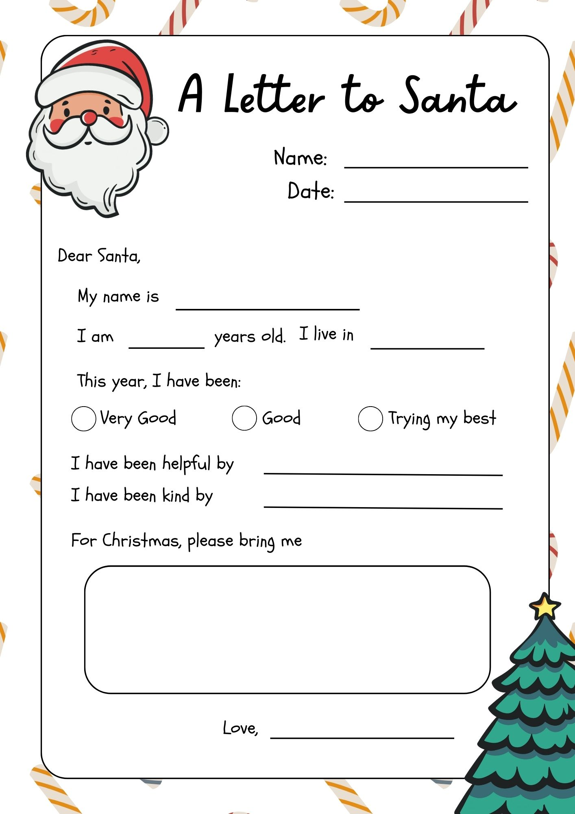

<div align="center">

  <a href="https://git.io/typing-svg">
    
  </a>

  <br/>
  
  

  <br/>

  <p>
    
    
    
  </p>

  <p>
    <a href="https://claus-console.vercel.app/">
      
    </a>
  </p>

  <p>
    <code>Authentication</code> • <code>Handwritten Letter Recognition</code> • <code>3D Generation</code> • <code>Augmented Reality</code> • <code>Real-Time Chat</code>
  </p>

</div>

<hr />

## 🎁 About The Project

**The C.L.A.U.S. Console** (Command Logic & Authorized User System) is the comprehensive digital transformation initiative for North Pole Industries.

### 🎅 The "Real-World" Problem

For centuries, the North Pole has relied on manual scroll-keeping and snail mail to manage billions of wishes annually. This legacy system suffered from:

-   **Too Many Letters**: Santa gets millions of handwritten letters, and reading them all takes forever.
-   **Will It Fit?**: Sometimes kids ask for giant toys (like drum sets) without knowing if they'll actually fit in their room.
-   **Snail Mail is Slow**: If you do something nice right before Christmas, Santa might not hear about it in time using old mail!

### 💡 The Solution

The C.L.A.U.S. Console is the high-tech upgrade the North Pole needed.

-   **Scan & Send**: Snap a photo or upload your handwritten letter. It zooms straight to Santa's Factory instantly!
-   **Magic Toy Generator**: Our AI reads your wish and creates a 3D model of it. You check it, and if it's perfect, the elves get to work.
-   **AR Room Preview**: Once the toy is ready, use your phone to see it magically appear in your room. Check if it fits before Christmas morning!
-   **Live Santa Chat**: Talk to Santa in real-time! Send wishes, explain your behavior, or just say hi through a direct secure line.

> _"Modernizing magic, one wish at a time."_

## 🗺️ App Workflow

Explore the digital North Pole through these key terminals:

### 1. 🏠 Landing Zone

**File:** `client/src/pages/user/UserHome.tsx`
The entry point for all authorized users.

-   **Experience**: Users are greeted with festive "Jingle Bells" background music.
-   **Visuals**: Features high-fidelity 3D animations of Santa's flight path and interactive scrolling scenes.
-   **Action**: Gateways to all other console features start here.

### 2. 📸 Letter Scanner

**File:** `client/src/pages/user/ScannerPage.tsx`
The sophisticated input terminal for physical wishes.

-   **Function**: Users scan their handwritten letters using the device camera or file upload.
-   **Process**: The image is securely transmitted directly to the Santa Factory database for analysis.

### 3. 🧩 Magic Processing

**File:** `client/src/pages/user/ScanResultPage.tsx`
Where AI meets Christmas magic.

-   **Generation**: The system analyzes the letter's content and procedurally generates a 3D toy model representation.
-   **Approval**: Users review the generated toy. If it matches their heart's desire, they send it to the Elves for fabrication.

### 4. 📜 The Manifest

**File:** `client/src/pages/user/ApprovedWishesPage.tsx`
The official registry of granted requests.

-   **Tracking**: View all wishes that have been green-lit by the North Pole command.
-   **Status**: Monitor the fabrication status and access the AR preview access codes from here.

### 5. 🪄 AR Room Preview

**File:** `client/src/pages/user/SingleWishPage.tsx`
Bringing the gift home (virtually) before Christmas.

-   **Augmented Reality**: Once approved by Santa, users can project the 3D toy into their physical room.
-   **Verification**: Ensure the gift fits on the shelf (or in the garage) using cutting-edge WebXR.

### 6. 💬 SantaComms (Real-Time)

**File:** `client/src/components/CommLinkWidget.tsx`
The direct line to the Big Guy.

-   **Live Chat**: A secure, WebSocket-encrypted channel for real-time negotiation.
-   **Status**: Discuss "Naughty/Nice" standing or update wish details instantly.

## 📹 Video Demonstrations

See the C.L.A.U.S. Console in action!

|                                 **Full Website Walkthrough**                                  |                                 **Mobile AR & Letter Scanning**                                 |
| :-------------------------------------------------------------------------------------------: | :---------------------------------------------------------------------------------------------: |
| [](https://youtu.be/ZiDnEWMMCN4) | [](https://youtu.be/ZiDnEWMMCN4) |
|                               _Desktop Dashboard & SantaComms_                                |                                 _Real-time AR & Camera Capture_                                 |

## 📸 Functionality Showcase

### 🔮 3D Generation (AI-to-Toy)

See how the C.L.A.U.S. Console interprets written wishes into production-ready 3D blueprints.

|                                                                   |                                                                   |                                                                   |
| :---------------------------------------------------------------: | :---------------------------------------------------------------: | :---------------------------------------------------------------: |
|  |  |  |
|  |  |  |

### 👓 AR Experience (In-Room)

The final verification step: bringing the north pole into your living room.

|                                                                   |                                                                   |                                                                   |
| :---------------------------------------------------------------: | :---------------------------------------------------------------: | :---------------------------------------------------------------: |
|  |  |  |

<hr />

### 📝 Official Scan Template

You can use this letter template, or write your own handwritten letter! Santa actually prefers handwritten notes over digital text—they have more Christmas spirit.

<div align="center">
  
</div>

## 🛠️ Tech Stack

This project leverages a modern **MERN** stack and **Generative AI** with powerful extensions for 3D and real-time communication.

<div align="center">
  <a href="https://skillicons.dev">
    
  </a>
</div>

| Domain       | Technologies                                                                                      |
| :----------- | :------------------------------------------------------------------------------------------------ |
| **Frontend** | React 19, Vite, TailwindCSS v4, Framer Motion, Three.js (@react-three/fiber), Google Model Viewer |
| **Backend**  | Node.js, Express, Mongoose (MongoDB), Socket.io                                                   |
| **Services** | Firebase (Auth), Cloudinary (Media), Google Gemini AI (Intelligence)                              |

## ✨ Key Features

-   **🪄 AR Gift Preview**: visualize your 3D wishes in the real world using WebXR.
-   **💬 SantaComms**: Direct, real-time WebSocket chat with Santa Claus.
-   **📜 Smart Wishlist**: Create, manage, and track your holiday wishes.
-   **📱 Responsive & Interactive**: A "wow" UI with glassmorphism, animations, and mobile-first design.
-   **🔒 Secure Access**: Firebase Authentication ensures only good kids get in.

## 🚀 How to Run

Clone the repository to your local machine:

```bash
git clone https://github.com/Rahul-R79/The-C.L.A.U.S.-Console.git
```

### 1. 🛠️ Client Setup

Navigate to the client folder and set up the environment variables:

```bash
cd client
cp .env.example .env
npm install
```

**Required Variables (`client/.env`):**

```env
VITE_SANTA_USERNAME=santa@claus.com
VITE_SANTA_PASSWORD=hohoho2025
VITE_FIREBASE_API_KEY=...
VITE_FIREBASE_AUTH_DOMAIN=...
VITE_FIREBASE_PROJECT_ID=...
VITE_FIREBASE_STORAGE_BUCKET=...
VITE_FIREBASE_MESSAGING_SENDER_ID=...
VITE_FIREBASE_APP_ID=...
```

Run the frontend:

```bash
npm run dev
```

### 2. ⚙️ Server Setup

Navigate to the server folder and configure the backend:

```bash
cd server
cp .env.example .env
npm install
```

**Required Variables (`server/.env`):**

```env
PORT=8080
MONGODB_URI=...
GEMINI_API_KEY=...
TRIPO_API_KEY=...
CLOUDINARY_CLOUD_NAME=...
CLOUDINARY_API_KEY=...
CLOUDINARY_API_SECRET=...
GOOGLE_APPLICATION_CREDENTIALS=./serviceAccountKey.json
```

Run the backend:

```bash
npm run dev
```

The client usually runs on `http://localhost:5173` and the server on `http://localhost:8080`.

## 📜 License

Distributed under the ISC License. See `LICENSE` for more information.

<div align="center">
  <br/>
  
  <p>Made with ❤️ and 🍪 at the North Pole</p>
</div>
